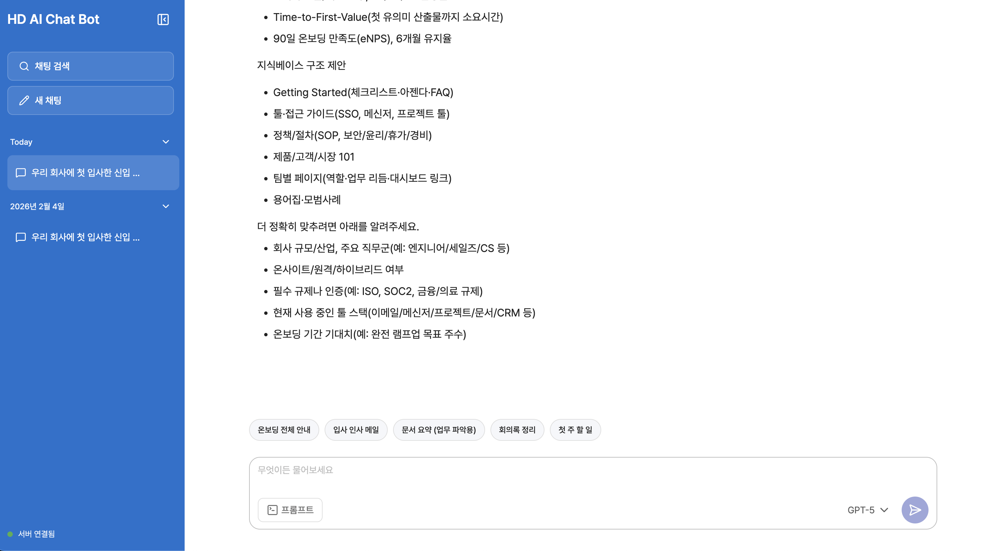

# HD AI Chatbot Service

생성형 AI Chatbot 서비스 입니다.



## 기술 스택 (주요 버전)

| 구분         | 기술                          | 버전                         |
| ------------ | ----------------------------- | ---------------------------- |
| 런타임/빌드  | Node (pnpm)                   | packageManager: pnpm@10.26.2 |
| 프레임워크   | React                         | ^19.2.4                      |
| 빌드         | Vite                          | 7.3.1                        |
| 언어         | TypeScript                    | ^5.9.3                       |
| 스타일       | Emotion (styled)              | ^11.14.1                     |
| 라우팅       | React Router                  | ^7.11.0                      |
| 서버 상태    | TanStack Query                | ^5.90.12                     |
| 로컬 상태/DB | Zustand, Dexie                | ^5.0.10, ^4.2.1              |
| 마크다운     | react-markdown, remark-gfm    | ^10.1.0, ^4.0.1              |
| 테스트       | Vitest, React Testing Library | ^4.0.18, ^16.3.2             |
| 린트/포맷    | ESLint, Prettier              | ^9.39.2, ^3.7.4              |

자세한 내용은 [docs/SPEC.md](docs/SPEC.md) 참고.

## 설치 및 실행

### pnpm 설치

```bash
npm install -g pnpm
```

### 프로젝트 설치 및 실행

```bash
pnpm install
pnpm dev
```

- 빌드: `pnpm build`
- 프리뷰: `pnpm start`
- 테스트: `pnpm test` / `pnpm test:unit` / `pnpm test:ui`
- 린트: `pnpm lint` / `pnpm lint:fix`
- 포멧: `pnpm format`

채팅 API는 별도 백엔드 서버가 필요합니다. 서버 설정은 [server/README.md](server/README.md)를 참고하세요.

## 문서

- [기능–컴포넌트 매핑](docs/FEATURES.md): 구현된 기능과 해당 컴포넌트/모듈 위치.
- [아키텍처](docs/ARCHITECTURE.md): FSD 구조, TanStack Query, 팩토리 패턴(Query options), 순환 참조 정리.
- [화면·데이터 흐름](docs/FLOW.md): 라우트 → 페이지 → 위젯 및 데이터 흐름 요약.
- [API 에러 핸들링](docs/API_ERROR_HANDLING.md): API/네트워크/Rate Limit 처리 및 사용자용 에러 메시지.

## 구현된 기능 목록

- 기본 채팅 UI: 사이드바(히스토리), 검색창, 채팅 리스트, 입력창(시스템 프롬프트, 모델 설정)
- 스트리밍 채팅: 생성형 AI 스트리밍 호출, 실시간 처리, 마크다운 렌더링, 로딩, 에러, 취소
- 모델 선택 / 시스템 프롬프트 설정 및 저장·로드
- 대화 히스토리 저장, 관리 (새로고침 유지, 사이드바에서 선택·삭제)
- 대화 검색: 키워드 검색, 결과 수, 다음 결과 이동, 하이라이팅, Debounce

상세 목록은 [docs/FEATURES.md](docs/FEATURES.md)를 참고하세요.

## 사용자 경험 개선

- 채팅/대화 진입 시 메시지 목록이 항상 최하단(최신 메시지)으로 스크롤됨 (검색 결과 진입 포함).
- 대화별로 입력창 초안이 유지되어, 대화를 전환했다 돌아와도 이전 입력 내용이 남아 있음.
- 검색 결과 클릭 시 해당 대화로 이동 후 최하단 스크롤 + 키워드 하이라이트·검색 상태바로 결과 표시.
- 검색 시 디바운스 적용으로 실시간 검색 지원.
- 현재 대화 내 검색 시 화살표로 다음/이전 결과 이동 및 하이라이트.
- 채팅 입력창 위 프롬프트 모드: 온보딩 안내, 입사 메일, 문서 요약, 회의록 정리 등 선택 시 해당 프롬프트가 입력창에 채워짐.
- API/네트워크 오류 시 한글 에러 메시지로 토스트 안내.
- 스트리밍 응답 중 "응답 중단" 버튼으로 즉시 취소 가능.
- 서버 헬스 체크: API 서버 상태를 확인하고, 실패 시 왼쪽 하단에 연결 상태를 표시

## 환경 변수 (.env)

```bash
VITE_H_CHAT_API_URL=http://localhost:8000
```

- .env.example 에서 .example 을 삭제하시면 됩니다.

## 빌드

프로덕션 빌드는 Vite `build` 옵션으로 벤더 청크를 분리(react, markdown, ui, data 등)해 초기 로드 용량을 나누고, 재방문 시 캐시 활용이 잘 되도록 구성해 두었습니다. `pnpm build` 후 `dist/`에서 산출물을 확인할 수 있습니다.
